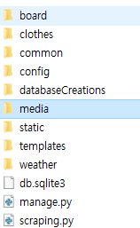
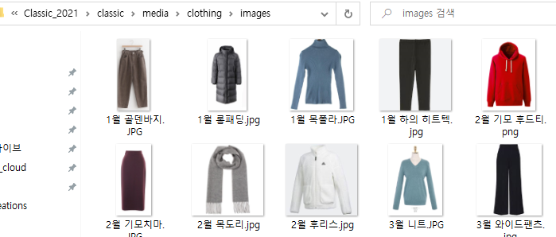

# Classic_2021

멀티캠퍼스 클라우드 Semi Project with Django


## Clothes & weather 부분 실행할때 주의 사항

전반적인 UI설계 : https://ovenapp.io/project/1LCiBn9is97OcLJChFgIT1FFCe3T9rne#KW9OA

초기 데이터를 만들기 위해선 

## 1. manage.py가 있는 디렉토리에서 default 유저를 생성한다.

```python
python manage.py createsuperuser 

사용자 이름 (leave blank to use '여러분 환경'): default
```


이것만 이렇게 해주고 나머지는 기억할 수 있는 대로 생성하면 된다.


## 2. Basic_Datas에 있는 이미지를 **media\clothing\images** 폴더를 생성한 후 이미지를 넣어둔다.

media폴더 위치는 다음과 같다 저 media 폴더 생성후 clothing 폴더 생성하고 아래에 images 폴더를 생성한후



Basic_Datas.zip을 압축해제하면



다음과 같이 설정이 된다.

## 3. 혹시나 설치 되어서 사용될 수 있는 모듈들이 있을수 있으므로

```python
pip install asgiref        
pip install Django          
pip install django-appconf  
pip install django-filter   
pip install django-imagekit 
pip install numpy          
pip install pandas          
pip install pilkit          
pip install Pillow          

```

이 명령어들을 실행해야 한다.


## 4. python manage.py runserver를 하기전

### clothes 폴더의 views.py의  createDB() 주석 처리한 부분을  지워주고 실행해야 한다.


그리고 아래 주석에 적힌대로 한번 실행한 다음 바로 주석처리를 해야 데이터가 중복해서 들어가지 않는다.. 

> 이건 수정사항이 필요함 일단 filtering을 구현하는데 필요한 데이터들을 급하게 집어넣음.

### 한번 런서버를 한 후 데이터가 들어갔으면 주석처리 해야한다. -> 이러지 않으면 데이터가 중복으로 생성이 된다.


