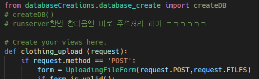

# Classic_2021

멀티캠퍼스 클라우드 Semi Project with Django

## Clothes & weather 부분 실행할때 주의 사항

전반적인 UI설계 : https://ovenapp.io/project/1LCiBn9is97OcLJChFgIT1FFCe3T9rne#KW9OA

초기 데이터를 만들기 위해선 

## clothes 폴더의 views.py의  createDB() 주석 처리한 부분을  지워주고 실행해야 한다.

그리고 아래 주석에 적힌대로 한번 실행한 다음 바로 주석처리를 해야 데이터가 중복해서 들어가지 않는다.. 

> 이건 수정사항이 필요함 일단 filtering을 구현하는데 필요한 데이터들을 급하게 집어넣음.

이미지들은 현재 구조상 

**classic\media\clothing\images**라는 폴더에 들어가는데 현재 기본 데이터들은 미리 넣어줘야 하기 때문에 따로 clone을 받고 **media\clothing\images** 폴더를 생성한 후, **Basic_Datas.zip**이라는 파일 압축해제한 후 넣어주면 된다.

> ~~한글이름과 띄어쓰기가 들어가서 수정이 요망~~ 

